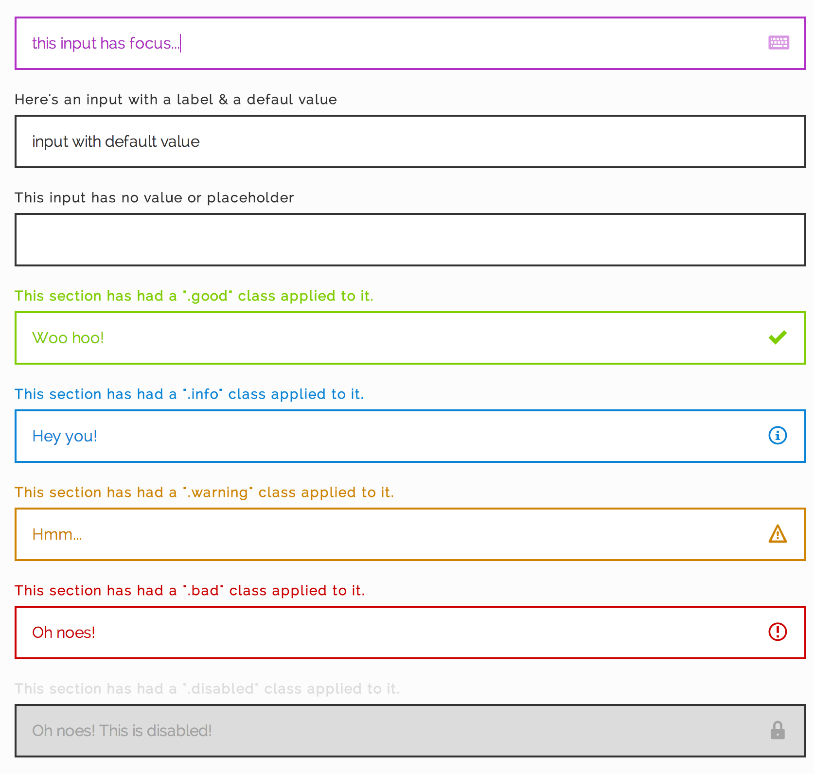

# Johnny 5

### Boilerplate Forms for Sass

*This is a work in progress. Lot's of cleanup & addition needed before production use.*

Forms are a pain in the ass. The idea behind this is to have a quick & simple Sass module to use as a boilerplate for web forms.

It will have sane defaults that are easy to override using a [_config.scss](public/css/_config/_johnny5.scss) file.

From here you will be able to easily customize padding, font sizes, icons, colors, padding, etc.

